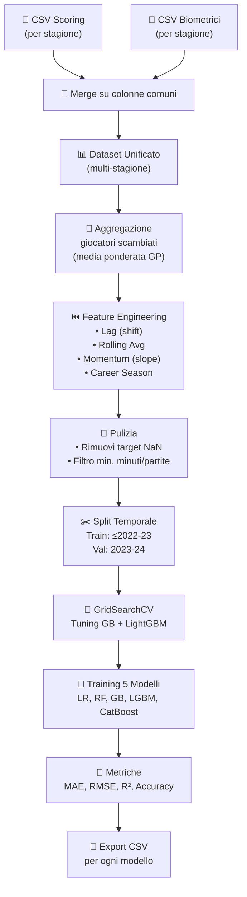

# Spiegazione Concettuale di `progetto_biometria.py`

Questo script costruisce un sistema di **Machine Learning per prevedere i punti a partita (PPG) che un giocatore NBA farà nella stagione successiva**, partendo da dati biometrici e statistiche di scoring. Di seguito la spiegazione parte per parte.

---

## 1. Importazioni (righe 1–14)

```python
import pandas as pd                          # 1
import numpy as np                            # 2
from sklearn.ensemble import GradientBoostingRegressor, RandomForestRegressor  # 3
from sklearn.linear_model import LinearRegression  # 4
from sklearn.pipeline import make_pipeline    # 5
from sklearn.preprocessing import StandardScaler  # 6
from sklearn.metrics import mean_absolute_error, mean_squared_error, r2_score  # 7
from sklearn.model_selection import GridSearchCV  # 8
import lightgbm as lgb                        # 9
from catboost import CatBoostRegressor        # 10
import glob                                   # 13
import os                                     # 14
```

| Riga | Concetto |
|------|----------|
| **1–2** | **Pandas** per la manipolazione tabellare dei dati, **NumPy** per il calcolo numerico vettorizzato. Sono le fondamenta di qualsiasi pipeline di data science in Python. |
| **3–4** | Si importano **3 algoritmi di regressione** da scikit-learn: Gradient Boosting (boosting su alberi), Random Forest (bagging su alberi) e Regressione Lineare (modello parametrico classico). |
| **5–6** | `make_pipeline` consente di concatenare trasformazioni e modello in un unico oggetto. `StandardScaler` normalizza le feature sottraendo la media e dividendo per la deviazione standard — fondamentale per la Regressione Lineare che è sensibile alla scala delle variabili. |
| **7** | Si importano le **metriche di valutazione**: MAE (errore medio assoluto), MSE (errore quadratico medio) e R² (coefficiente di determinazione, che misura quanta varianza del target viene spiegata dal modello). |
| **8** | `GridSearchCV` implementa la **ricerca esaustiva degli iperparametri** con validazione incrociata (cross-validation): prova tutte le combinazioni di parametri e restituisce la migliore. |
| **9–10** | **LightGBM** (Microsoft) e **CatBoost** (Yandex): due librerie di gradient boosting ad alte prestazioni, spesso superiori a scikit-learn su dati tabulari. |
| **13–14** | `glob` per la ricerca di file con pattern (wildcard), `os` per le operazioni sul filesystem. |

> [!NOTE]
> I modelli scelti coprono tre famiglie: **lineari** (baseline), **bagging** (Random Forest) e **boosting** (GB, LightGBM, CatBoost). Questo confronto è una best practice per capire quale approccio si adatta meglio ai dati.

---

## 2. Caricamento e Merge dei Dati (righe 16–29)

```python
scoring_files = sorted(glob.glob("scoring/*.csv"))          # 16
dfs = []                                                     # 17
for sf in scoring_files:                                     # 18
    bf = sf.replace("scoring\\nba_scoring_", "bio\\nba_bio_").replace(...)  # 19
    if os.path.exists(bf):                                   # 20
        s_df = pd.read_csv(sf)                               # 21
        b_df = pd.read_csv(bf)                               # 22
        common_cols = list(set(s_df.columns).intersection(b_df.columns))  # 23
        merged = pd.merge(s_df, b_df, on=common_cols)        # 24
        dfs.append(merged)                                   # 25
df = pd.concat(dfs, ignore_index=True)                       # 29
```

### Concetto teorico: **Data Integration (Fusione di sorgenti multiple)**

- **Riga 16**: Cerca tutti i file CSV nella cartella `scoring/` (uno per stagione NBA) e li ordina cronologicamente.
- **Riga 19**: Per ogni file di scoring, costruisce il percorso corrispondente del file biometrico (nella cartella `bio/`), sostituendo nel nome `scoring → bio`.
- **Righe 21–22**: Carica entrambi i CSV come DataFrame.
- **Righe 23–24**: Trova le **colonne in comune** tra i due DataFrame (es. `PLAYER_NAME`, `_season`) e fa un **merge** (join) su quelle colonne. Questo accoppia le statistiche di scoring con i dati biometrici dello stesso giocatore nella stessa stagione.
- **Riga 29**: **Concatena** tutti i DataFrame risultanti in un unico dataset verticale, creando un dataset multi-stagione.

> [!IMPORTANT]
> Il merge sulle colonne comuni è un **inner join naturale**: vengono mantenuti solo i giocatori presenti in entrambe le fonti. Questo garantisce che ogni riga abbia sia dati biometrici sia statistiche di gioco.

---

## 3. Preparazione e Rinomina Colonne (righe 33–43)

```python
df['PLAYER'] = df['PLAYER_NAME']                             # 33
df['SEASON'] = df['_season']                                 # 34
df['HEIGHT'] = df['PLAYER_HEIGHT_INCHES'] * 2.54             # 36
df['MPG'] = df['MIN']                                        # 37
df['PPG'] = df['PTS']                                        # 38
df['FG%'] = df['FG_PCT']                                     # 40
df['TS%'] = df['TS_PCT']                                     # 41
df['USG%'] = df['USG_PCT']                                   # 42
df['WIN_RATE'] = df['W_PCT']                                 # 43
```

### Concetto: **Data Standardization**

Le colonne vengono rinominate per uniformità e leggibilità. Notare:
- **Riga 36**: conversione da **pollici a centimetri** (`× 2.54`) — standardizzazione delle unità di misura.
- **Righe 40–42**: le percentuali di tiro vengono rinominate con la notazione convenzionale del basket (`FG%`, `TS%`, `USG%`).

---

## 4. Aggregazione Giocatori Scambiati (righe 45–63)

```python
agg_weighted = ['MPG', 'PPG', 'TRB', ...]                   # 49-50
agg_sum = ['GP', 'W', 'L']                                  # 51
agg_first = ['PLAYER', 'SEASON', 'NAT']                     # 52

def wavg(col):                                               # 54
    return lambda x: np.average(x, weights=df.loc[x.index, 'GP'])  # 56

df = df.groupby(['PLAYER_ID', 'SEASON'], as_index=False).agg(agg_dict)  # 62
```

### Concetto teorico: **Weighted Aggregation per gestire entità duplicate**

Un giocatore scambiato a metà stagione compare nel dataset con **più righe** (una per ogni squadra in cui ha giocato). Questo crea un problema: le sue statistiche sono frammentate.

La soluzione:

| Tipo di statistica | Aggregazione | Motivo |
|---|---|---|
| **Per-game** (PPG, MPG, FG%…) | **Media ponderata per GP** | Se un giocatore ha giocato 50 partite con la squadra A e 10 con la B, le sue statistiche con A devono pesare 5× di più. |
| **Contatori** (GP, W, L) | **Somma** | Il totale di partite è la somma delle partite giocate con ogni squadra. |
| **Anagrafica** (nome, nazionalità) | **Primo valore** | Sono invarianti — basta prendere il primo. |

- **Riga 56**: La funzione `wavg` crea una **closure** che, data una serie di valori, calcola `np.average(valori, weights=GP)` usando i Games Played come pesi.
- **Riga 62**: Il `groupby` raggruppa per (`PLAYER_ID`, `SEASON`) e applica le aggregazioni definite, producendo **una sola riga per giocatore per stagione**.

---

## 5. Lag Features e Target (righe 65–82)

```python
df['NEXT_PPG'] = df.groupby('PLAYER')['PPG'].shift(-1)      # 67

df['PREV_PPG']   = df.groupby('PLAYER')['PPG'].shift(1)     # 70
df['PREV_PPG_2'] = df.groupby('PLAYER')['PPG'].shift(2)     # 71
df['PREV_USG%']  = df.groupby('PLAYER')['USG%'].shift(1)    # 72
df['PREV_GP']    = df.groupby('PLAYER')['GP'].shift(1)      # 73

df['PREV_PPG']   = df['PREV_PPG'].fillna(df['PPG'])         # 76
df['PPG_TREND']  = df['PPG'] - df['PREV_PPG']               # 82
```

### Concetto teorico: **Lag Features e formulazione del problema come Time Series Regression**

Questo è il cuore concettuale del progetto. L'idea è:

> *"Per prevedere cosa farà un giocatore **domani**, guardo cosa ha fatto **ieri** e **l'altroieri**."*

- **Riga 67 — Target (`NEXT_PPG`)**: `shift(-1)` sposta i PPG di una posizione **in alto** nel tempo. Quindi, per la riga della stagione 2022-23 di LeBron, `NEXT_PPG` contiene i PPG della stagione 2023-24. Questo è il **valore da prevedere**.
- **Righe 70–73 — Lag features**: `shift(1)` sposta **in basso** (nel passato). `PREV_PPG` contiene i punti della stagione precedente, `PREV_PPG_2` quelli di due stagioni fa. Questo dà al modello una **memoria storica**.
- **Righe 76–79 — Fillna**: Per un rookie (prima stagione), non esiste un "anno precedente". Si riempie il vuoto con il valore corrente — l'unica informazione disponibile.
- **Riga 82 — Trend**: La differenza `PPG_corrente - PPG_precedente` cattura se il giocatore sta **migliorando** (+) o **peggiorando** (-).

> [!WARNING]
> Il **data leakage** è il rischio principale nel time-series ML: se nelle feature si usano dati futuri rispetto al target, il modello "bara". Le lag features con `shift(1)` garantiscono di usare solo dati passati.

---

## 6. Rolling Averages — Medie Mobili a 3 Stagioni (righe 84–101)

```python
df['PPG_ROLL3'] = df.groupby('PLAYER')['PPG'].transform(
    lambda x: x.shift(1).rolling(3, min_periods=1).mean())   # 87-88
```

### Concetto teorico: **Smoothing con Media Mobile**

Le medie mobili "lisciano" la serie storica, riducendo il **rumore** delle singole stagioni e catturando il **trend di fondo**.

- `shift(1)`: evita il leakage — la media mobile non include la stagione corrente.
- `rolling(3, min_periods=1)`: calcola la media sulle ultime 3 stagioni. Con `min_periods=1`, anche un giocatore con una sola stagione precedente ottiene un valore valido.
- **Righe 97–101**: I valori mancanti (prime stagioni) vengono riempiti con il valore corrente della statistica originale.

> [!TIP]
> La media mobile è più robusta del singolo valore lag: se un giocatore ha avuto una stagione anomala (infortuni, cambio ruolo), il rolling average attenua quell'effetto.

---

## 7. Momentum — Slope Lineare (righe 103–121)

```python
def compute_slope(series):                                   # 106
    s = series.shift(1)                                      # 108
    for i in range(len(s)):                                  # 110
        window = s.iloc[max(0, i-2):i+1].dropna()            # 111
        if len(window) >= 2:                                 # 112
            slope = np.polyfit(x, window.values, 1)[0]       # 114
```

### Concetto teorico: **Regressione Lineare Locale come indicatore di tendenza**

Il **momentum** è la **pendenza (slope)** di una retta interpolata sui PPG delle ultime 3 stagioni. È più sofisticato del semplice trend (differenza):

| Indicatore | Formula | Cosa cattura |
|---|---|---|
| **Trend** | `PPG(t) − PPG(t-1)` | Variazione puntuale rispetto a un solo anno |
| **Momentum** | Slope di `polyfit` su 3 punti | Direzione e velocità del cambiamento su un arco temporale più ampio |

- **Slope > 0**: il giocatore sta **crescendo** in modo costante.
- **Slope < 0**: il giocatore sta **calando**.
- **Slope ≈ 0**: prestazione **stabile**.

`np.polyfit(x, y, 1)[0]` esegue una regressione lineare ai minimi quadrati e restituisce il coefficiente angolare.

---

## 8. Contatore Stagioni e Pulizia Dataset (righe 123–143)

```python
df['CAREER_SEASON_NUM'] = df.groupby('PLAYER').cumcount() + 1  # 126
df_pulito = df.dropna(subset=['NEXT_PPG'])                     # 129
df_pulito['TOTAL_MIN'] = df_pulito['MPG'] * df_pulito['GP']    # 134
df_pulito = df_pulito[df_pulito['TOTAL_MIN'] >= 120]           # 135
df_pulito = df_pulito[df_pulito['GP'] >= 12]                   # 136
df_pulito['GP_RATE'] = df_pulito['GP'] / 82                    # 140
df_pulito['PEAK_AGE_DIST'] = abs(df_pulito['AGE'] - 27)       # 143
```

| Riga | Concetto |
|------|----------|
| **126** | **Numerazione progressiva** della carriera. `cumcount()` conta quante righe precedenti esistono per lo stesso giocatore. Un giocatore al 10° anno avrà valore 10 — il modello può così distinguere veterani da rookie. |
| **129** | Rimuove le righe dell'**ultima stagione** (2024-25): non conoscendo il futuro, non hanno un target su cui addestrarsi. |
| **134–136** | **Data cleaning**: elimina i giocatori con campione troppo piccolo (<120 minuti totali o <12 partite giocate), le cui statistiche sono statisticamente inaffidabili. |
| **140** | **GP_RATE** = percentuale di partite giocate su 82 (stagione regolare NBA). Cattura la **disponibilità** del giocatore — un infortunato cronico ha un valore basso. |
| **143** | **PEAK_AGE_DIST** = distanza dall'età di picco atletico (27 anni). La relazione età-prestazione nel basket è una **curva a campana**: questa feature linearizza quel concetto. |

---

## 9. Selezione Feature e Split Temporale (righe 145–182)

```python
feature_cols = [                                              # 146-164
    "AGE", "HEIGHT", "MPG", "PPG", "GP", "W",
    "TRB", "AST", "FG%", "TS%", "USG%", "NET_RATING",
    "OREB_PCT", "DREB_PCT", "AST_PCT",
    "WIN_RATE", "PEAK_AGE_DIST", "GP_RATE",
    "PREV_PPG", "PREV_PPG_2", "PPG_TREND", "PREV_USG%", "PREV_GP",
    "PPG_ROLL3", "USG_ROLL3", "TS_ROLL3", "NET_ROLL3",
    "PPG_MOMENTUM", "CAREER_SEASON_NUM"
]

df_train = df_pulito[df_pulito['SEASON'] != '2023-24']       # 176
df_val   = df_pulito[df_pulito['SEASON'] == '2023-24']       # 180
```

### Concetto teorico: **Temporal Split (Walk-Forward Validation)**

A differenza del classico split casuale, qui si usa uno **split temporale**:

```
Train:      1996-97 → 2022-23  (~27 stagioni)
Validation: 2023-24            (1 stagione)
```

> [!IMPORTANT]
> In un problema di **predizione temporale**, lo split casuale causerebbe **data leakage temporale** — il modello vedrebbe dati "futuri" durante il training. Lo split temporale simula il caso reale: addestro su tutto il passato e testo sull'ultima stagione conosciuta.

Le **28 feature** selezionate coprono 6 categorie concettuali:

| Categoria | Feature | Cosa catturano |
|---|---|---|
| **Biometria** | AGE, HEIGHT | Fisicità e fase della carriera |
| **Volume di gioco** | MPG, GP, W, GP_RATE | Quanto il giocatore è impiegato |
| **Produzione** | PPG, TRB, AST | Output statistico grezzo |
| **Efficienza** | FG%, TS%, USG%, NET_RATING | Qualità del gioco, non solo quantità |
| **Avanzate** | OREB_PCT, DREB_PCT, AST_PCT | Ruolo e impatto sul gioco |
| **Temporali/Storiche** | PREV_PPG, PREV_PPG_2, PPG_TREND, ROLL3, MOMENTUM, CAREER_SEASON_NUM | Traiettoria della carriera |

---

## 10. Hyperparameter Tuning con GridSearchCV (righe 186–210)

```python
param_grid_gb = {
    'n_estimators': [100, 150, 200],
    'learning_rate': [0.03, 0.05, 0.1],
    'max_depth': [3, 4, 5]
}                                                            # 191-195
gs_gb = GridSearchCV(GradientBoostingRegressor(random_state=0),
                     param_grid_gb, cv=3, scoring='r2', n_jobs=-1)  # 196
gs_gb.fit(X_train, y_train)                                  # 197
```

### Concetto teorico: **Model Selection via Cross-Validation**

Gli **iperparametri** sono le "manopole" del modello che non vengono apprese dai dati ma decise a priori:

| Iperparametro | Significato |
|---|---|
| `n_estimators` | Numero di alberi nell'ensemble (più alberi = più potenza, ma più lento) |
| `learning_rate` | Quanto ciascun albero contribuisce (basso = apprendimento graduale e robusto) |
| `max_depth` | Profondità massima di ogni albero (alto = più espressivo ma rischio overfitting) |
| `num_leaves` (LightGBM) | Numero di foglie — controlla la complessità del singolo albero |

**GridSearchCV** prova **tutte le combinazioni** (3×3×3 = 27 per GB, 3×3×3×3 = 81 per LightGBM) e per ognuna esegue una **3-fold cross-validation** sul training set, selezionando la combinazione con il miglior R².

- `n_jobs=-1`: usa tutti i core della CPU per parallelizzare.
- `random_state=0`: fissa il seed per la riproducibilità.

---

## 11. Definizione e Addestramento dei Modelli (righe 212–227)

```python
modelli = {
    "Regressione Lineare": make_pipeline(StandardScaler(), LinearRegression()),   # 213
    "Random Forest": RandomForestRegressor(random_state=42),                      # 214
    "Gradient Boosting (Tuned)": gs_gb.best_estimator_,                          # 215
    "LightGBM (Tuned)": gs_lgb.best_estimator_,                                 # 216
    "CatBoost": CatBoostRegressor(random_state=0, verbose=0)                     # 217
}

for nome_modello, modello in modelli.items():                # 225
    modello.fit(X_train, y_train)                            # 227
```

### I 5 modelli a confronto:

| # | Modello | Famiglia | Note |
|---|---------|----------|------|
| 1 | **Regressione Lineare** | Parametrico lineare | Baseline. Necessita di `StandardScaler` perché i coefficienti sono sensibili alla scala. |
| 2 | **Random Forest** | Bagging (ensemble di alberi indipendenti) | Robusto all'overfitting, meno preciso dei boosting. |
| 3 | **Gradient Boosting** | Boosting (alberi sequenziali che correggono gli errori) | Tuned con GridSearchCV. |
| 4 | **LightGBM** | Boosting (variante histogram-based, più veloce) | Tuned con GridSearchCV. |
| 5 | **CatBoost** | Boosting (gestione nativa delle feature categoriche) | Parametri di default; `verbose=0` sopprime l'output. |

> [!TIP]
> I modelli GB e LightGBM usano `gs_gb.best_estimator_` — l'istanza del modello già configurata con i migliori iperparametri trovati dalla GridSearch. Vengono poi **ri-addestrati** su `X_train` completo alla riga 227.

---

## 12. Validazione e Metriche (righe 229–248)

```python
predizioni_val = modello.predict(X_val)                      # 230
mae  = mean_absolute_error(y_val, predizioni_val)            # 231
mse  = mean_squared_error(y_val, predizioni_val)             # 232
rmse = np.sqrt(mse)                                          # 233
r2   = r2_score(y_val, predizioni_val)                       # 234

somma_errori = np.sum(np.abs(y_val - predizioni_val))        # 237
somma_punti_reali = np.sum(y_val)                            # 238
accuracy_globale = 100 - ((somma_errori / somma_punti_reali) * 100)  # 239
```

### Metriche spiegate:

| Metrica | Formula | Interpretazione |
|---------|---------|-----------------|
| **MAE** | `mean(\|yᵢ − ŷᵢ\|)` | Errore medio in **punti a partita** — intuitivo e nella stessa unità del target. |
| **MSE** | `mean((yᵢ − ŷᵢ)²)` | Penalizza di più gli errori grandi (elevazione al quadrato). |
| **RMSE** | `√MSE` | Riporta l'MSE nella stessa scala del target, mantenendo la penalizzazione degli outlier. |
| **R²** | `1 − SS_res/SS_tot` | Quota di varianza spiegata. R²=0.85 significa che l'85% della variabilità nei PPG è catturata dal modello. |
| **Accuracy (WMAPE)** | `100 − (Σ\|errori\| / Σ\|reali\|) × 100` | Una "accuracy" basata sull'errore percentuale pesato (**Weighted Mean Absolute Percentage Error**). Dà più peso ai giocatori con PPG alti. |

---

## 13. Test su un Giocatore Casuale (righe 250–260)

```python
giocatore_scelto = np.random.choice(giocatori_validi)        # 222
giocatore_val = df_val[df_val["PLAYER"] == giocatore_scelto] # 251
predizione = modello.predict(X_giocatore)[0]                 # 255
errore_singolo = abs(predizione - y_reale)                   # 256
acc_singola = max(0, 100 - (errore_singolo / y_reale * 100)) # 257
```

### Concetto: **Case Study / Sanity Check**

Dopo le metriche aggregate, si testa il modello su un **singolo giocatore estratto a caso** dal validation set. Questo serve a:
1. **Rendere tangibile** il risultato: "per LeBron abbiamo previsto 25.3 PPG, reali 25.7" è più comprensibile di "MAE = 1.8".
2. **Sanity check**: se il modello dà risultati assurdi per un giocatore noto, qualcosa non va.

L'accuracy singola è calcolata come `100 − (errore_assoluto / valore_reale) × 100`, con floor a 0.

---

## 14. Esportazione Risultati (righe 262–273)

```python
df_risultati = df_val[['PLAYER', 'SEASON']].copy()           # 263
df_risultati['REALE_NEXT_PPG'] = y_val                       # 266
df_risultati['PREDIZIONE'] = np.round(predizioni_val, 1)     # 267
nome_file = f"Predizioni_{nome_modello.replace(' ', '_')}.csv"  # 269
df_risultati.to_csv(nome_file, index=False)                  # 270
```

Ogni modello produce un file CSV con:
- Nome del giocatore e stagione
- Tutte le feature usate
- Il valore **reale** di NEXT_PPG
- La **predizione** del modello (arrotondata a 1 decimale)

Questo permette l'analisi post-hoc giocatore per giocatore.

---

## Schema Architetturale Complessivo



---

## Riepilogo dei Concetti Chiave

| Concetto | Dove nel codice | Perché è importante |
|----------|----------------|---------------------|
| **Data Integration** | Righe 16–29 | Unisce fonti eterogenee in un unico dataset |
| **Weighted Aggregation** | Righe 45–62 | Gestisce correttamente giocatori con più entry |
| **Lag Features** | Righe 65–82 | Fornisce al modello memoria storica |
| **Rolling Averages** | Righe 84–101 | Smoothing del rumore stagionale |
| **Momentum (Slope)** | Righe 103–121 | Quantifica la traiettoria della carriera |
| **Temporal Split** | Righe 176–182 | Evita data leakage temporale |
| **Hyperparameter Tuning** | Righe 186–210 | Ottimizza automaticamente i modelli |
| **Ensemble Comparison** | Righe 212–248 | Identifica il modello migliore empiricamente |
| **WMAPE Accuracy** | Righe 237–239 | Metrica intuitiva pesata per i PPG |
